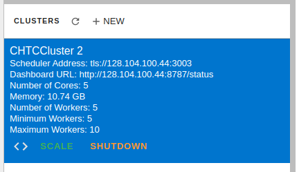

.. _configuration:

.. py:currentmodule:: dask_chtc

Configuration
=============

Dask-CHTC uses
`Dask's configuration system <https://docs.dask.org/en/latest/configuration.html>`_
for most configuration needs.
Dask stores configuration files in
`YAML format <https://en.wikipedia.org/wiki/YAML>`_
in the directory ``~/.config/dask`` (where ``~`` means "your home directory").
Any YAML files in this directory will be read by Dask when it starts up
and integrated into its runtime configuration.

Configuring Dask-CHTC
---------------------

Dask-CHTC's :class:`CHTCCluster` is a type of Dask-Jobqueue cluster, so it is
configured through
`Dask-Jobqueue's configuration system <https://jobqueue.dask.org/en/latest/configuration-setup.html>`_.

This is the default configuration file included with Dask-CHTC:

.. literalinclude:: ../../dask_chtc/jobqueue-chtc.yaml
    :language: yaml

A copy of this file (with everything commented out) will be placed in
``~/.config/dask/jobqueue-chtc.yaml`` the first time you run Dask-CHTC.
Options found in that file are used as defaults for the runtime arguments of
:class:`CHTCCluster` and its parent classes in Dask-Jobqueue, starting with
:class:`dask_jobqueue.HTCondorCluster`.
You can override any of them at runtime by passing different arguments to the
:class:`CHTCCluster` constructor.

Dask-CHTC provides a command line tool to help inspect and edit its
configuration file. For full details, run ``dask-chtc config --help``.
The subcommands of ``dask-chtc config`` will (among other things)
let you show the contents of the configuration file, open it in your editor,
and reset it to the package defaults.

.. warning::

    Dask-CHTC is prototype software, and the names and meanings of configuration
    options are not necessarily stable. Be prepared to reset your configuration
    to track changes in Dask-CHTC!

Configuring the Dask JupyterLab Extension
-----------------------------------------

The `Dask JupyterLab extension <https://github.com/dask/dask-labextension>`_
lets you view the Dask scheduler's dashboard as part of your JupyterLab.
It can also be used to launch a Dask cluster.
To configure the cluster that it launches, you write a Dask configuration
file, typically stored at ``~/.config/dask/labextension.yaml``.
Here is an minimal configuration file for launching a :class:`CHTCCluster`:

.. code-block:: yaml

    labextension:
      factory:
        module: 'dask_chtc'
        class: 'CHTCCluster'
        kwargs: {}
      default:
        workers: null
        adapt: null

Configuration options set via ``~/.config/dask/jobqueue-chtc.yaml`` will be
honored by the JupyterLab extension; note that you are specifying arguments
in the extension configuration file as if you were calling the
:class:`CHTCCluster` constructor directly.

To connect to the cluster created by the lab extension, you must pass
the appropriate security options through.
First, get the security options:

.. code-block:: python

    from dask_chtc import CHTCCluster

    sec = CHTCCluster.security()

Then, (after creating a new cluster by clicking ``+NEW``),
click the ``<>`` button to insert a cell with the right cluster address:

And modify it to use the security options
by adding the ``security`` keyword argument:

.. code-block:: python

    from dask.distributed import Client

    client = Client("tls://128.104.100.44:3003", security=sec)
    client
