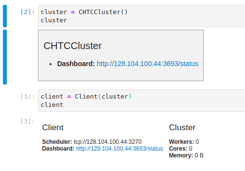

.. _networking:

Networking and Port Forwarding
==============================

.. py:currentmodule:: dask_chtc

For security reasons, most
`ports <https://en.wikipedia.org/wiki/Port_(computer_networking)>`_
on CHTC submit and execute nodes are not open for traffic.
This means that programs that need to communicate over ports, like
the Dask distributed scheduler
or a Jupyter notebook server,
will not be able to communicate with your computer, or possibly even with
other computers inside the CHTC pool, over any given set of ports.

Port Forwarding for Jupyter Notebook Servers on Submit Nodes
------------------------------------------------------------

A Jupyter notebook server is, essentially, a web application.
For example, when you run ``jupyter lab`` on your local machine,
you are starting up a web server that listens for internet connections on
a particular port.
You may recall seeing a message that looks like this during startup:

.. code-block::

    [I 10:52:56.060 LabApp] The Jupyter Notebook is running at:
    [I 10:52:56.060 LabApp] http://localhost:8888/?token=3342f18a95d7d61c51a2b8cf80b836e932ac53f9ebdb3965
    [I 10:52:56.060 LabApp]  or http://127.0.0.1:8888/?token=3342f18a95d7d61c51a2b8cf80b836e932ac53f9ebdb3965

You typically visit one of those addresses using your web browser to connect the
JavaScript-based "frontend" interface to the notebook server "backend".
The ``/?token=...`` part of each address is an authorization token;
it prevents anyone who doesn't have it from
actually running any code on your notebook server.
The actual addresses are ``http://localhost:8888`` and ``http://127.0.0.1:8888``
The part before the second ``:`` is the address of the machine
(like in a normal website address),
except that in this case they are both special addresses which "loopback"
on the machine itself.
The number after the second ``:`` is the port number to talk to on the machine.
So both of these addresses are variations on "talk to port 8888 on myself".

When you :ref:`run a Jupyter notebook server on a CHTC submit node <jupyter>`,
you'll get the same kinds of addresses, but you won't be able to connect to them
from the web browser on your local machine: the addresses mean "talk to myself",
but "myself" is the submit node, not your local machine.

To work around this issue, you can "forward" a port from the submit machine
back to your local machine using ``ssh``. A port on your machine and a port on
the submit machine will be "tied together" over your existing SSH connection.
Connecting to that port on your local machine (the "local" port)
will effectively connect to the target port of the submit machine
(the "remote" port).

There are two ways to forward ports using ``ssh``, depending on when you know
which ports you want to forward.
If you know the local and remote port numbers ahead of time,
you can specify port forwarding using the ``-L`` argument of ``ssh``:

.. code-block:: console

    $ ssh -L localhost:3000:localhost:4000 <user@hostname>

That command would connect local port 3000 to remote port 4000.
A Jupyter notebook running on port 4000 on the remote machine, like so:

.. code-block:: console

    $ dask-chtc jupyter run lab --port 4000
    [... Jupyter startup logs cut ...]
    [I 13:06:41.784 LabApp] The Jupyter Notebook is running at:
    [I 13:06:41.784 LabApp] http://localhost:4000/?token=1186ba8ed4248f58338c48e3c016e192eb43f9c8d470e37d
    [I 13:06:41.784 LabApp]  or http://127.0.0.1:4000/?token=1186ba8ed4248f58338c48e3c016e192eb43f9c8d470e37d

Could be reached from a web browser running on your computer by going to
``http://localhost:3000``.
For simplicity, we recommend using the same port number for the local and remote
ports -- then you can just copy-paste the address from the Juypter logs!

If you don't know the port number ahead of time (perhaps the remote port you wanted
to use is already in use, and the Jupyter notebook server actually starts up
on port 4001), you can forward a port from an existing SSH session by opening
the "SSH command line".
From the terminal, inside the SSH session, type ``~C``
(i.e., hold shift and press the ``~`` key, release shift, then hold shift again
and press the ``C`` key).
Your prompt should change to

.. code-block:: console

    ssh>

In this prompt, enter a ``-L`` argument like above and press enter:

.. code-block:: console

    ssh> -L localhost:3001:localhost:4001
    Forwarding port.

Press enter again to return to your normal terminal prompt.
The port is now forwarded, as if you had added the ``-L`` argument to your
original ``ssh`` command.

.. _dashboard-port-forwarding:

Forwarding a Port for the Dask Dashboard
----------------------------------------

The Dask scheduler exposes a
`dashboard <https://docs.dask.org/en/latest/diagnostics-distributed.html#dashboard>`_
as a web application.
If you are using Dask through Jupyter, the dashboard address will be shown
in the representations of both the ``Cluster`` and ``Client``:

Programmatically, the address is available in
``client.scheduler_info()['services']``.

Be wary: Dask is showing an "external" address that would be appropriate for a
setup without security firewalls.
Instead of connecting to that address, you should point your web browser
(or the Dask Jupyterlab extension, for example) to something like
``localhost:<port>/status``, after forwarding the remote port that the dashboard
is hosted on to some local port.

Dask Scheduler and Worker Internal Networking
---------------------------------------------

The Dask scheduler and workers all need to talk to each bidirectionally.
This is handled internally by Dask-CHTC, and you shouldn't have to do anything
about it.
Please
`let us know <https://github.com/JoshKarpel/dask-chtc/issues>`_
if you run into any issues you believe are caused by
internal networking failures.
